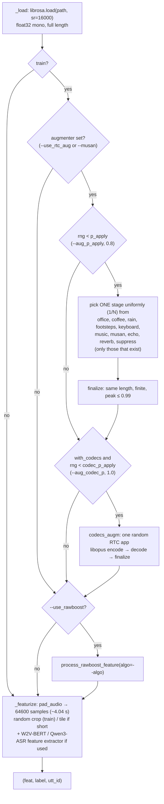

# Training-time augmentation

This document explains how audio is augmented during training in `SLS_setup/`: which augmentations exist, how they are chosen for each clip, how command-line flags reach them, and how to enable them.

Code involved:

| File | Role |
|---|---|
| [`SLS_setup/main_train.py`](../SLS_setup/main_train.py) | CLI flags (lines 136–185), dataset/loader construction, startup log of the augmentation setup |
| [`SLS_setup/utils/data_utils.py`](../SLS_setup/utils/data_utils.py) | `build_augmenter`, `SpoofAudioDataset` (load → augment → crop/featurize), RawBoost dispatch |
| [`SLS_setup/utils/rtc_augment.py`](../SLS_setup/utils/rtc_augment.py) | RTC augmenter: noise/echo/reverb/MUSAN/music/DeepFilterNet stages + RTC codec |
| [`SLS_setup/utils/RawBoost.py`](../SLS_setup/utils/RawBoost.py) | RawBoost synthetic-noise algorithms (Tak et al., ICASSP 2022) |
| [`SLS_setup/utils/loudness.py`](../SLS_setup/utils/loudness.py) | Optional read-time loudness normalisation (`--loudness_norm`), applied before every augmentation and also on dev / eval |

---

## 1. Overview

There are **two independent augmentation families**. Each one is optional and controlled by its own flags:

1. **RTC augmenter** (`RTCAugmenter`). It reproduces the conditions of the noisy subset of the challenge eval set by mixing in **real recorded** noise, echo and room impulse responses. It then passes the clip through an **RTC app codec** (QQ, Zoom, WeChat, DingTalk, Lark, VooV, Telegram), using an Opus encode and decode in ffmpeg.
2. **RawBoost** (`process_rawboost_feature`). This adds **synthetic** signal distortions: convolutive, impulsive and stationary noise.

Both run **only on the training set**:

- `build_dataset_from_protocol(..., mode="train")` builds the augmenter and sets `train=True`.
- The dev set (`mode="dev"`) gets `augmenter=None`, `use_rawboost=False` and `train=False`.
- `main_eval.py` builds `SpoofAudioDataset` with the default `train=False`. That makes `_augment` a no-op, so evaluation audio is never augmented.

Augmentation runs **on the fly** in the DataLoader workers. Each epoch therefore sees a fresh random augmentation of every clip; nothing is cached to disk.

---

## 2. Per-clip pipeline

Each training sample goes through `SpoofAudioDataset.__getitem__` ([data_utils.py:188](../SLS_setup/utils/data_utils.py#L188)):



The order of operations is fixed:

1. `_load`: the clip is read at 16 kHz. With `--loudness_norm` it is then normalised to a fixed integrated loudness (see §2.1), **before** anything below and regardless of `train`.
2. `_augment` ([data_utils.py:159](../SLS_setup/utils/data_utils.py#L159)) applies the RTC augmenter first, then RawBoost.
3. `_featurize` ([data_utils.py:174](../SLS_setup/utils/data_utils.py#L174)) calls `pad_audio(audio, 64600, random_start=True)`, which takes a random crop of a long clip or tiles a short one. If a W2V-BERT or Qwen3-ASR backbone is used, its HF feature extractor then runs on that crop.

Augmentation is therefore applied to the **full-length clip before cropping**. Noise windows, echo and reverb are computed over the whole recording, and the model sees a random ~4 s crop of the result.

### 2.1 Loudness normalisation (`utils/loudness.py`, `--loudness_norm`)

A deterministic pre-processing step, not an augmentation: with `--loudness_norm [--loudness_norm_lufs -23]` every clip is scaled to the target integrated loudness (ITU-R BS.1770-4 LUFS, measured with [`pyloudnorm`](https://github.com/csteinmetz1/pyloudnorm)) inside `SpoofAudioDataset._load`, i.e. on the full-length clip, before the RTC augmenter, the level augmenter and RawBoost. Because it lives in `_load` and not in `_augment`, it runs on the **train, dev, local-eval and inference** datasets alike, so the model sees one level distribution at training and test time. It complements the stochastic, training-only level augmentation (`--use_level_aug`), which can still randomise the level afterwards.

- Default target **-23 LUFS** (EBU R128 speech reference; speech peaks stay below full scale). `--loudness_norm_lufs` overrides it (streaming services use -14, the `probe_loudnorm` set was built with ffmpeg `loudnorm` at -16).
- Clips shorter than one 400 ms gating block and clips the gate measures as silent (every block below -70 LUFS) are returned unchanged (`LoudnessNormalizer.skipped` counts them).
- If the gain still pushes a peak above 1.0 the clip goes through `finalize` like every other stage (scaled to a 0.99 peak), so hot targets such as -14 end up below target on peaky clips.
- Cost: about 2 ms per 4 s clip, paid in the DataLoader workers.
- **Evaluation must match training.** `main_train.py` records the flags in `config.yaml` (`loudness_norm:` line and `args`). `scripts/eval_checkpoints.py` reads them back from `config.yaml` (override with `--loudness_norm` / `--no_loudness_norm`); `scripts/local_eval.py` and `main_eval.py` need `--loudness_norm [--loudness_norm_lufs X]` passed explicitly. `scripts/local_eval.py` caches scores per set name, so use a fresh `--out` (or `--force`) when toggling the flag. Under the flag the `probe_orig` / `probe_gain_*` / `probe_loudnorm` sets become (nearly) the same audio, so those probes stop measuring anything.
- Dependency: `pip install pyloudnorm==0.2.0` in the run env (`/root/.conda/envs/rtc-sdd`). It is imported only when the flag is on.

---

## 3. RTC augmenter (`utils/rtc_augment.py`)

### 3.1 Selection rule

`RTCAugmenter.__call__` ([rtc_augment.py:348](../SLS_setup/utils/rtc_augment.py#L348)) works in two steps.

1. **Acoustic stage** (`_stage`, [line 366](../SLS_setup/utils/rtc_augment.py#L366)):
   - With probability `p_apply`, the augmenter draws **exactly one** stage, uniformly from the list of available stages. Each stage has probability `p_apply / N`, where `N` is the number of available stages.
   - With probability `1 - p_apply` the clip is left clean.
   - Stages are **never chained**, because each noisy eval clip carries a single condition.
2. **Codec** (in series): when codecs are enabled, the output of step 1 goes through one RTC app codec with probability `codec_p_apply`. This happens whether or not an acoustic stage was applied. The default is 1.0, so **every** training clip is codec-processed.

With the defaults (`p_apply=0.8`, `codec_p_apply=1.0`, all 7 RTC stages present):

| Clip receives | Probability |
|---|---|
| codec only (clean acoustics) | 0.20 |
| a specific acoustic stage + codec | 0.8 / 7 ≈ 0.114 each |

### 3.2 Stages

| Stage name | Function | What it does | Source of the material | Enabled by |
|---|---|---|---|---|
| `office`, `coffee` | `add_noise` | Mixes a random window of a noise recording at a random SNR | RNNoise background noise, <https://media.xiph.org/rnnoise/data/> | `--use_rtc_aug` + subdirectory in `--aug_noise_dirs` |
| `rain`, `footsteps`, `keyboard` | `add_noise` | same | ESC-50, <https://github.com/karolpiczak/ESC-50> | `--use_rtc_aug` + subdirectory in `--aug_noise_dirs` |
| *any other subdirectory name* | `add_noise` | same; the stage is named after the directory | anything you put there | `--use_rtc_aug` + subdirectory in `--aug_noise_dirs` |
| `music` | `add_noise` | same | user-supplied music | `--use_rtc_aug` + `--aug_music_dirs` |
| `musan` | `add_noise` | same | MUSAN, **non-speech only** (scanned recursively) | `--musan` (+ `--musan_dir`) |
| `echo` | `add_echo` | Adds one attenuated delayed copy of the clip (CLAD's AddEchoes) | no files needed | `--use_rtc_aug` |
| `reverb` | `add_reverb` | Convolves the clip with a measured RIR | RNNoise `measured_rirs-v3.tar.gz` | `--use_rtc_aug` + `--aug_rir_dirs` |
| `suppress` | `suppress` → `deepfilternet_suppress` | Runs DeepFilterNet noise suppression on the clip, as RTC endpoints do | DeepFilterNet model (`pip install deepfilternet`) | `--aug_use_deepfilternet` + an augmenter (see §7) |

Per-stage details:

- **`add_noise`** ([line 121](../SLS_setup/utils/rtc_augment.py#L121)):
  - Picks a random file from the stage's pool.
  - `read_window` decodes only a random window of the needed length. It averages stereo to mono, resamples to 16 kHz with exact-ratio `resample_poly`, and tiles the noise if it is shorter than the clip.
  - Scales the noise to a random SNR in `snr_db = (5, 20)` dB relative to the speech power.
  - Skips the mix if either signal is silent.
- **`add_echo`** ([line 136](../SLS_setup/utils/rtc_augment.py#L136)): computes `out[d:] += audio[:-d] * g`, with delay `d` ~ U(40, 160) ms and gain `g` ~ U(0.15, 0.5).
- **`add_reverb`** ([line 145](../SLS_setup/utils/rtc_augment.py#L145)):
  - Reads a random RIR. Headerless `.f32` files are read as little-endian float32 at 48 kHz; other formats go through soundfile. The RIR is resampled to 16 kHz.
  - Removes the propagation delay by cutting everything before the peak.
  - Truncates the RIR to `rir_max_seconds = 2.0` and normalizes it to unit energy.
  - Convolves with `fftconvolve`, trims to the original length, and rescales to the input RMS (`match_level`).
- **`suppress`** ([line 199](../SLS_setup/utils/rtc_augment.py#L199)):
  - Resamples to DeepFilterNet's rate (48 kHz), enhances, and resamples back.
  - The model is loaded lazily, once per worker process.
  - Any exception passes the audio through unchanged.

### 3.3 RTC codec (`codecs_augm`)

[`codecs_augm`](../SLS_setup/utils/rtc_augment.py#L179):

1. Picks one app uniformly from `codec_apps` (default: all 7).
2. Draws a bitrate, bandwidth cutoff and frame size from that app's profile.
3. Pipes the raw float32 audio through `ffmpeg -c:a libopus` into an in-memory Ogg stream, then decodes it back to 16 kHz float32.

| App | Bitrate (kbps, uniform int) | `-cutoff` (Hz) | Frame (ms) | `-application` | Note |
|---|---|---|---|---|---|
| `qq` | 10–24 | 6000 / 8000 | 20 | voip | SILK, emulated by low-rate narrow-band Opus |
| `wechat` | 8–20 | 4000 / 8000 | 20 | voip | SILK v3, emulated by low-rate narrow-band Opus |
| `zoom` | 24–48 | 8000 | 20 | voip | |
| `dingtalk` | 16–32 | 8000 | 20 / 40 | voip | |
| `lark` | 24–40 | 8000 | 20 | voip | WebRTC Opus |
| `voov` | 16–32 | 6000 / 8000 | 20 | voip | |
| `telegram` | 16–32 | 8000 | 20 / 60 | audio | Opus voice notes |

ffmpeg has no SILK encoder, so QQ and WeChat are approximated by Opus at a low rate with a narrow cutoff, which pushes Opus into its SILK layer. The decoded output then goes through `finalize`, which pads or trims it back to the input length, because Opus pre-skip and padding change the sample count. If ffmpeg is missing or fails, the clip **passes through unchanged** and a warning is printed. A failed codec call never crashes training.

### 3.4 Keeping the output well-behaved

- `finalize` ([line 220](../SLS_setup/utils/rtc_augment.py#L220)) runs after every stage and after the codec:
  - forces float32 1-D output;
  - pads or trims to the input length;
  - returns the **original** audio if anything is NaN or Inf;
  - rescales to a 0.99 peak if the peak exceeds 1.0.
- `match_level` ([line 211](../SLS_setup/utils/rtc_augment.py#L211)) is used by reverb so the stage cannot change the loudness.
- Clips shorter than 16 samples are returned untouched.

### 3.5 Randomness

- The augmenter uses its own `numpy.random.Generator`, created lazily for each process by `make_rng(seed)` ([line 234](../SLS_setup/utils/rtc_augment.py#L234)). The seed mixes in `os.getpid()`:
  - Forked DataLoader workers each get a **different** stream. Without this, every worker would replay identical augmentations.
  - As a consequence, augmentations are **not bit-reproducible across runs**, because the pids differ.
- `--seed` (default 1234) is passed through as the base seed.
- RawBoost uses the global `np.random` state instead, not this generator.

### 3.6 How the noise pools are discovered

`_add_noise_dir` ([line 317](../SLS_setup/utils/rtc_augment.py#L317)) is called for each directory in `--aug_noise_dirs`:

- Audio files (`.wav .flac .ogg .mp3`) placed **directly** in the root become a pool named after the root directory, lowercased. For example, files in `data/augm/noise/` create a stage called `noise`.
- **Each first-level subdirectory** becomes its own stage, named after the lowercased subdirectory. Only files directly inside it are used; the scan is not recursive.
- A directory that is missing or empty creates no stage. A missing root prints `[rtc_augment] missing pool dir: ...`.
- Two directories with the same name, across several roots, are merged into one pool.

Other pools are discovered as follows:

- `--aug_music_dirs`: every directory's files (non-recursive) go into one `music` pool.
- `--musan_dir`: scanned **recursively** into one `musan` pool, with no filtering.
- `--aug_rir_dirs`: every directory's files (non-recursive; `.wav .flac .ogg .mp3 .f32`) go into one RIR list.

The final stage list is built in this order: noise and music pools (sorted by name), then `echo`, `reverb` (if any RIR was found) and `suppress` (if DeepFilterNet loaded).

### 3.7 `RTCAugConfig` fields

[`RTCAugConfig`](../SLS_setup/utils/rtc_augment.py#L247) is filled by `build_augmenter`. Several fields have **no CLI flag**; to change them, edit the dataclass defaults or `build_augmenter`.

| Field | Default | CLI flag |
|---|---|---|
| `noise_dirs` | `[]` | `--aug_noise_dirs` (only with `--use_rtc_aug`) |
| `music_dirs` | `[]` | `--aug_music_dirs` (only with `--use_rtc_aug`) |
| `rir_dirs` | `[]` | `--aug_rir_dirs` (only with `--use_rtc_aug`) |
| `musan_dirs` | `[]` | `[--musan_dir]` when `--musan` |
| `with_echo` | `True` | set to the value of `--use_rtc_aug` |
| `p_apply` | `0.8` | `--aug_p_apply` |
| `max_stages` | `1` | `--aug_max_stages` (**ignored**; values > 1 only print a warning) |
| `seed` | `None` | `--seed` |
| `suppress_fn` | `None` | `--aug_use_deepfilternet` |
| `sr` | `16000` | — |
| `snr_db` | `(5.0, 20.0)` | — |
| `echo_delay_ms` | `(40.0, 160.0)` | — |
| `echo_strength` | `(0.15, 0.5)` | — |
| `rir_max_seconds` | `2.0` | — |
| `with_codecs` | `False` | `--use_rtc_aug` and not `--no_codec_aug` |
| `codec_p_apply` | `1.0` | `--aug_codec_p` |
| `codec_apps` | all 7 apps | — |
| `verbose` | `True` | — |

---

## 4. RawBoost (`utils/RawBoost.py`)

RawBoost is enabled with `--use_rawboost` and applied **after** the RTC augmenter. Unlike the RTC augmenter, it has no probability: when enabled, **every** training clip gets it. `--algo` selects the variant ([data_utils.py:228](../SLS_setup/utils/data_utils.py#L228)):

| `--algo` | Variant |
|---|---|
| 1 | **LnL**: linear + non-linear convolutive noise (random notch-filter bank applied to `x, x², …, x^N_f`) |
| 2 | **ISD**: impulsive signal-dependent noise (random samples perturbed) |
| 3 | **SSI**: stationary signal-independent noise (coloured Gaussian noise at random SNR) |
| 4 | 1 → 2 → 3 in series |
| **5** (default) | 1 → 2 in series |
| 6 | 1 → 3 in series |
| 7 | 2 → 3 in series |
| 8 | 1 and 2 in parallel on the same input, summed, then peak-normalized |
| anything else (e.g. 0) | no-op |

The parameters keep the original RawBoost defaults:

| Flag | Default | Used by | Meaning |
|---|---|---|---|
| `--N_f` | 5 | LnL | number of non-linear orders (powers of x) |
| `--nBands` | 5 | LnL, SSI | notch-filter bands per filter |
| `--minF` / `--maxF` | 20 / 8000 | LnL, SSI | band centre frequency range (Hz) |
| `--minBW` / `--maxBW` | 100 / 1000 | LnL, SSI | band width range (Hz) |
| `--minCoeff` / `--maxCoeff` | 10 / 100 | LnL, SSI | FIR filter order range |
| `--minG` / `--maxG` | 0 / 0 | LnL, SSI | filter gain range (dB) |
| `--minBiasLinNonLin` / `--maxBiasLinNonLin` | 5 / 20 | LnL | gain reduction (dB) for the non-linear terms |
| `--P` | 10 | ISD | max % of samples perturbed |
| `--g_sd` | 2 | ISD | perturbation gain |
| `--SNRmin` / `--SNRmax` | 10 / 40 | SSI | SNR range (dB) |

---

## 5. How the flags reach the dataset

```
main_train.py  argparse
   └─ build_dataset_from_protocol(train_protocol, train_data_path, mode="train", args, algo=args.algo)   (main_train.py:206)
        ├─ use_rawboost = args.use_rawboost
        ├─ augmenter    = build_augmenter(args)                                    (data_utils.py:88)
        │                   ├─ returns None unless --use_rtc_aug or --musan
        │                   ├─ RTCAugConfig(...)  ← flags (see §3.7)
        │                   ├─ --aug_use_deepfilternet → make_deepfilternet_suppressor()
        │                   └─ RTCAugmenter(cfg)  → lists pools, builds stage list, prints describe()
        └─ SpoofAudioDataset(train=True, augmenter, use_rawboost, algo, args)
   └─ build_dataset_from_protocol(dev_protocol, ..., mode="dev")  → no augmenter, no RawBoost
   └─ DataLoader(num_workers=--num_workers, persistent_workers=True)  → augmentation runs in workers
```

At startup, `main_train.py` prints the resolved setup. **Always check this output.**

```
[rtc_augment] p_apply=0.8 one stage/clip, equal chance 1/7 | snr=5..20 dB | stages=[coffee, footsteps, keyboard, office, rain, echo, reverb] | pools=(coffee:N, footsteps:N, keyboard:N, office:N, rain:N) | rirs=N | then codec p=1.0 [qq, wechat, zoom, dingtalk, lark, voov, telegram]
...
RTC augmentation: <same describe() string>     # or "RTC augmentation: off"
RawBoost: algo 5                                 # or "RawBoost: off"
```

- `stages=[...]` shows what will actually be drawn, and `equal chance 1/N` gives the per-stage share of `p_apply`.
- `pools=(name:count)` and `rirs=count` give the number of files found. A stage that is missing here means its directory was not found or was empty.
- `then codec off` means `--no_codec_aug` was set, or `--use_rtc_aug` was not.

---

## 6. CLI reference (`main_train.py`)

| Flag | Default | Effect |
|---|---|---|
| `--use_rtc_aug` | off | Enables the RTC augmenter with the noise pools, `echo`, `reverb` and music, plus the RTC codec |
| `--aug_noise_dirs DIR [DIR ...]` | `data/augm/noise` | Noise roots; each subdirectory is one stage (see §3.6) |
| `--aug_music_dirs DIR [DIR ...]` | none | Optional `music` pool |
| `--aug_rir_dirs DIR [DIR ...]` | `data/augm/measured_rirs` | RIR pool for `reverb` |
| `--aug_p_apply P` | 0.8 | Probability that a clip gets one acoustic stage |
| `--aug_max_stages N` | 1 | Ignored; always one stage per clip |
| `--aug_use_deepfilternet` | off | Adds the `suppress` stage (requires `deepfilternet`) |
| `--no_codec_aug` | off | With `--use_rtc_aug`, disables the codec |
| `--aug_codec_p P` | 1.0 | Probability that a clip goes through one RTC codec |
| `--musan` | off | Adds the `musan` stage; works with or without `--use_rtc_aug` |
| `--musan_dir DIR` | `data/augm/musan` | MUSAN root, non-speech only, scanned recursively |
| `--loudness_norm` | off | Normalises every clip (train, dev, eval) to `--loudness_norm_lufs` at read time, before all augmentation (§2.1) |
| `--loudness_norm_lufs L` | -23.0 | Target integrated loudness in LUFS |
| `--use_rawboost` | off | Enables RawBoost on every training clip |
| `--algo N` | 5 | RawBoost variant (see §4) |
| RawBoost params | see §4 | |
| `--seed` | 1234 | Base seed (the augmenter also mixes in the worker pid) |
| `--num_workers` | 8 | DataLoader workers; this is where augmentation CPU cost is paid |

The relative default paths (`data/augm/...`) resolve from the **current working directory**. `main_train.py` must be run from `SLS_setup/` because of its `model.` and `utils.` imports, so by default they point to `SLS_setup/data/augm/...`. Absolute paths are safer.

---

## 7. Enable matrix

What a training clip can receive for each flag combination. RawBoost (`--use_rawboost`) is independent and, when on, is added to every row.

| `--use_rtc_aug` | `--musan` | `--no_codec_aug` | Acoustic stages in the draw (one per clip, prob. `p_apply`) | Codec |
|---|---|---|---|---|
| – | – | – | none (augmenter is `None`) | no |
| ✓ | – | – | noise subdirs + music + `echo` + `reverb` | yes (`--aug_codec_p`) |
| ✓ | – | ✓ | noise subdirs + music + `echo` + `reverb` | no |
| ✓ | ✓ | – | noise subdirs + music + `musan` + `echo` + `reverb` | yes |
| ✓ | ✓ | ✓ | noise subdirs + music + `musan` + `echo` + `reverb` | no |
| – | ✓ | (n/a) | `musan` only (no echo, no noise/RIR/music pools) | no |

`--aug_use_deepfilternet` adds `suppress` to the draw in any row where the augmenter exists. It has no effect in the first row.

---

## 8. Preparing the augmentation data

The code expects this layout. Directory names become stage names, so name them deliberately.

```
data/augm/
├── noise/                      # --aug_noise_dirs
│   ├── office/   *.wav         # RNNoise background noise  (S02)
│   ├── coffee/   *.wav         # RNNoise background noise  (S03)
│   ├── rain/     *.wav         # ESC-50 class "rain"       (S05)
│   ├── footsteps/*.wav         # ESC-50 class "footsteps"  (S06)
│   └── keyboard/ *.wav         # ESC-50 "keyboard_typing"  (S07)
├── measured_rirs/  *.f32       # --aug_rir_dirs; RNNoise measured_rirs-v3 (48 kHz raw float32) or *.wav
└── musan/                      # --musan_dir; ONLY the non-speech parts
    ├── noise/...
    └── music/...
```

Sources:

- RNNoise noise and measured RIRs: <https://media.xiph.org/rnnoise/data/> (`measured_rirs-v3.tar.gz`)
- CLAD AddEchoes (implemented in code, no data needed): <https://github.com/CLAD23/CLAD> (`DatasetUtils.py`)
- ESC-50: <https://github.com/karolpiczak/ESC-50> (categories `rain`, `footsteps`, `keyboard_typing`)
- MUSAN: <https://www.openslr.org/17/>. Keep only `noise/` and `music/` and **do not** include `speech/`. The challenge forbids extra speech data, and the code applies no filtering.

Any sample rate and channel count works: files are resampled to 16 kHz and downmixed to mono on the fly.

Runtime dependencies:

- `ffmpeg` with `libopus` on `PATH` for the codec. Check with `ffmpeg -hide_banner -encoders | grep libopus`.
- `soundfile` and `scipy`.
- Optionally `deepfilternet`, together with `torchaudio`.

---

## 9. Example training commands

All commands are run from `SLS_setup/`. Replace the `...` arguments with your usual data, protocol and model arguments: `--train_data_path --dev_data_path --train_protocol --dev_protocol --ssl_name --track ...`.

**Full RTC set + codec** (closest to the noisy eval conditions):
```bash
python main_train.py ... \
  --use_rtc_aug \
  --aug_noise_dirs /abs/path/data/augm/noise \
  --aug_rir_dirs   /abs/path/data/augm/measured_rirs
```

**RTC acoustic stages, no codec:**
```bash
python main_train.py ... --use_rtc_aug --no_codec_aug \
  --aug_noise_dirs /abs/path/data/augm/noise --aug_rir_dirs /abs/path/data/augm/measured_rirs
```

**RTC + MUSAN, codec on half of the clips, augmentation on 60 % of the clips:**
```bash
python main_train.py ... --use_rtc_aug --musan --musan_dir /abs/path/data/augm/musan \
  --aug_noise_dirs /abs/path/data/augm/noise --aug_rir_dirs /abs/path/data/augm/measured_rirs \
  --aug_p_apply 0.6 --aug_codec_p 0.5
```

**MUSAN only** (no echo, no codec):
```bash
python main_train.py ... --musan --musan_dir /abs/path/data/augm/musan
```

**RawBoost only:**
```bash
python main_train.py ... --use_rawboost --algo 5
```

**Everything:**
```bash
python main_train.py ... --use_rtc_aug --musan --use_rawboost --algo 5 --aug_use_deepfilternet \
  --aug_noise_dirs /abs/path/data/augm/noise --aug_rir_dirs /abs/path/data/augm/measured_rirs \
  --musan_dir /abs/path/data/augm/musan
```

**Codec only:** run `--use_rtc_aug --aug_p_apply 0`. This disables every acoustic stage; with the default `--aug_codec_p 1.0`, every clip is still codec-processed.

---

## 10. Gotchas and known issues

1. **The data-preparation script is missing.** `rtc_augment.py` and `main_train.py` refer to `scripts/prepare_rtc_aug_data.py`, but that file is not in the repository, and there is no `data/` directory. The pools must be built by hand (see §8).
2. **Missing directories fail silently.** If the pool directories don't exist, `--use_rtc_aug` still runs with only `echo` and the codec; a missing noise root prints just one warning line. Check `stages=[...]` and `pools=(...)` in the startup log (§5).
3. **The codec is on for every clip by default** (`--aug_codec_p 1.0`), so the model never trains on codec-free audio while `--use_rtc_aug` is set. Lower `--aug_codec_p` if the clean condition matters.
4. **A missing ffmpeg is not an error.** Each codec call fails, prints `[rtc_augment] codec ... failed`, and passes the audio through. If you see that message, the codec augmentation is not happening.
5. **Codec cost.** Every codec call spawns two ffmpeg subprocesses for the full-length clip. Give the loader enough `--num_workers`, or training becomes data-bound.
6. **DeepFilterNet cost.** The model runs on CPU inside each worker and is loaded once per worker. If `deepfilternet` is not importable, the program prints `DeepFilterNet not available; suppression stage disabled` and continues.
7. **The RawBoost default is inconsistent.** `main_train.py` defines `--use_rawboost` as `store_true`, so it is **off** by default. However, `build_dataset_from_protocol` uses `getattr(args, "use_rawboost", True)`, which defaults to on if the attribute is absent, for example when the dataset is built from another script. The `--no_rawboost` flag mentioned in the `rtc_augment.py` docstring does not exist.
8. **MUSAN is not filtered.** Everything under `--musan_dir` is mixed in as noise, so a `speech/` subfolder there would add speech, which the challenge does not allow.
9. **`--aug_max_stages` does nothing.** Augmentations are never stacked, apart from the codec and RawBoost, which follow the acoustic stage in series.
10. **Stage statistics are never reported.** `RTCAugmenter.stage_counts` is tallied in each worker process but never logged or aggregated.
11. **Paired / consistency mode is not wired up.** `SpoofAudioDataset` supports `pair_map` (returning two independently augmented views), but `main_train.py` never passes it, and `train_epoch` unpacks 3-tuples. Using it would require changes to the training loop.
12. **Augmentation is not reproducible.** The RTC augmenter mixes the worker pid into its seed, so two runs with the same `--seed` see different augmentations.
13. **Augmentation happens before cropping.** A noise burst or echo can fall outside the random 4 s crop, so a clip counted as augmented by `stage_counts` may look clean to the model.
