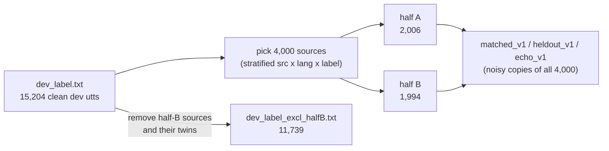

# Dev splits, validation and local WF1

This page explains:
- which dev files exist and what is in each one;
- what each file is used for (validation, checkpoint selection, local WF1);
- what you gain or lose by choosing one file over another.

**Short version**

- **Training** always uses `train_label.txt` only. No dev audio is ever trained on.
- **Validation** only *picks checkpoints* (best epoch, early stop, which epochs to merge). It never changes the weights.
- For new runs, validate on **`dev_label_excl_halfB.txt`**. That keeps half B of the sim sets unseen, so **`half_B` WF1** is an honest score.

Code involved:

| File | Role |
|---|---|
| [`scripts/build_dev_noisy_sim.py`](../scripts/build_dev_noisy_sim.py) | Builds every file on this page (frozen, v1) |
| [`configs/local_eval_sets.yaml`](../configs/local_eval_sets.yaml) | Lists the local eval sets and their roles |
| [`SLS_setup/main_train.py`](../SLS_setup/main_train.py) | Dev loss and per-epoch local WF1 (`--dev_protocol`, `--local_eval_sets`) |
| [`SLS_setup/utils/local_eval.py`](../SLS_setup/utils/local_eval.py) | Scoring, WF1, the `half="B"` filter |
| [`scripts/local_eval.py`](../scripts/local_eval.py) | Full local report (`full` and `half_B`) |

---

## 1. The files at a glance

| File | What it is | Size | Labels |
|---|---|---|---|
| `/mnt/paml-research/RTCFake/data/train_label.txt` | Official train set | 75,785 | yes |
| `/mnt/paml-research/RTCFake/data/dev_label.txt` | Official dev set, **all** of it (clean: offline + online) | 15,204 (7,739 offline + 7,465 online) | yes |
| `data/dev_noisy_sim/source_list.txt` | The 4,000 dev utterances the sim sets are made from, each tagged **A** or **B** | 4,000 (A 2,006 / B 1,994) | yes |
| `data/dev_noisy_sim/dev_label_excl_halfB.txt` | `dev_label.txt` **minus** every half-B source and its offline/online twin | 11,739 | yes |
| `data/dev_noisy_sim/dev_online_clean/protocol.txt` | All **online** dev utterances, unprocessed (clean proxy) | 7,465 | yes |
| `data/dev_noisy_sim/matched_v1/` | The 4,000 sources with **noise like training's** (other noise files) + Opus RTC codecs | 4,000 | yes |
| `data/dev_noisy_sim/heldout_v1/` | The 4,000 sources with noise, DSP and codecs (G.722 / G.726 / GSM) that are **never** used in training | 4,000 | yes |
| `data/dev_noisy_sim/echo_v1/` | The 4,000 sources with echo / AEC conditions | 4,000 | yes |
| `.../matched_v1/protocol_mini.txt`, `.../heldout_v1/protocol_mini.txt` | 1,000 **half-A** utterances of each, for fast per-epoch scoring | 1,000 each | yes |
| `data/dev_noisy_sim/probes_v1/` | Shortcut-audit probes (silence only, gain changes, ...). **Never part of WF1** | — | yes |
| `/mnt/paml-research/RTCFake/data/progress.txt` | Leaderboard audio, used only for submission | 30,279 | **no** |

Each sim folder also has a `meta.csv` (noise, SNR, codec, **`half`** per file) and a `MANIFEST.json`.

---

## 2. How half A and half B are made



- An offline utterance and its online twin carry the same speech. They always go to the **same half**, so the same speech never appears in both halves.
- Half **A** is for **selection**: the per-epoch mini sets are drawn from it.
- Half **B** is for the **final readout**: it is meant to stay unseen until you report results.

---

## 3. Which data is used where

| Step | Data | What it decides |
|---|---|---|
| Training (gradients) | `train_label.txt` + training augmentation | the weights |
| Validation: dev loss | `--dev_protocol` (recommended: `dev_label_excl_halfB.txt`) | `best_by_dev_loss.pth`, early stopping (default) |
| Validation: per-epoch local WF1 | 2,000 of `dev_online_clean` + `sim_matched_mini` + `sim_heldout_mini` (half A) | `best_by_wf1.pth`, `best_by_noisy_eer.pth`, `--keep_topk_by_wf1` |
| Final local report | `dev_online_clean` + `sim_matched_v1` + `sim_heldout_v1` (+ echo, probes) | the `full` and `half_B` WF1 you report |
| Submission | `progress.txt` (later the final eval set) | leaderboard only. **Never** use it to choose models |

**Local WF1**

```
WF1 = 0.3 * F1(clean) + 0.7 * mean( F1(sim_matched), F1(sim_heldout) )     all at threshold 0.5
```

`sim_echo` and the probes are reported, but they are **not** part of WF1.

---

## 4. Choosing the validation file (`--dev_protocol`)

Validation only picks checkpoints. A checkpoint picked on some utterances looks a little better on those utterances. That is a mild, selection-only leak. The question is **which sim half that leak touches**.

| `--dev_protocol` | Contains half-A sources? | Contains half-B sources? | Effect on local WF1 |
|---|---|---|---|
| `dev_label.txt` (old runs, e.g. `qwen-asr-1.7B-sls-e2e_...20260920`) | yes | **yes** | Both `full` and `half_B` are a bit optimistic. **Nothing is truly held out.** |
| `dev_label_excl_halfB.txt` (B0, L1, all new runs) | yes | **no** | `full` is a bit optimistic; **`half_B` is honest** (noisy part). |
| `dev_online_clean` as the dev set | yes | **yes** (online twins of half B) | Same problem as `dev_label.txt`, and offline audio is left out. **Do not use.** |

Things to know:
- Dev loss is measured on **clean** audio. It does not tell you how robust the model is to noise. That's why the per-epoch **local WF1** exists next to it.
- The old `dev_label.txt` **still works**: training runs the same and nothing crashes. You just lose the honest `half_B` number, and the run can't be compared fairly with B0 / L1.

---

## 5. Reading the local WF1 report

`scripts/local_eval.py` prints two WF1 lines:

| Line | Which utterances | Use it for |
|---|---|---|
| `[full] WF1_local@0.5` | all 4,000 sim utts + all 7,465 clean | a quick look; slightly optimistic |
| `[half_B] WF1_local@0.5` | the 1,994 half-B sim utts + the clean set | **the number to report and compare** |

**Caveat: the clean part of `half_B` is not filtered.**
`dev_online_clean` has no `half` column, so the `half_B` filter can't cut it down. The clean term (30% of WF1) always uses all 7,465 online utts. Of those:
- 5,753 are also in `dev_label_excl_halfB.txt`, the dev-loss set;
- the 2,000-utt per-epoch clean subsample overlaps them as well.

So only the **noisy 70%** of `half_B` WF1 is fully unseen. When two runs are within about 1 WF1, look at the noisy F1 values on their own too.

Other things to watch:
- Always pass the 17 report sets with `--names` (see §6). Without it, the half-A mini sets get pulled in: the `half_B` summary crashes and the numbers stop being comparable with B0.
- The most selection-free readout is the **last epoch's** checkpoint, because no checkpoint was picked. `best_by_wf1` was picked on half A, so it is slightly optimistic on half A but fair on half B.

---

## 6. Recipes

**Train with honest validation** (run from `SLS_setup/`):

```bash
/root/.conda/envs/rtc-sdd/bin/python main_train.py \
  --train_data_path /mnt/paml-research/RTCFake/data/wav/train \
  --train_protocol  /mnt/paml-research/RTCFake/data/train_label.txt \
  --dev_data_path   /mnt/paml-research/RTCFake/data/wav/dev \
  --dev_protocol    ../data/dev_noisy_sim/dev_label_excl_halfB.txt \
  --local_eval_sets ../configs/local_eval_sets.yaml \
  ...model / aug flags...
```

**Score a checkpoint on the sim splits:**

```bash
NAMES="dev_online_clean sim_matched_v1 sim_heldout_v1 sim_echo_v1 probe_orig probe_sil_only \
probe_noise_only probe_trimmed probe_padded probe_gain_up probe_gain_down probe_gain_m20 \
probe_gain_m6 probe_gain_p6 probe_gain_p10_limit probe_agc_dynaudnorm probe_loudnorm"

/root/.conda/envs/rtc-sdd/bin/python ../scripts/local_eval.py \
  --model_path exp/<run>/ckpt/best_by_wf1.pth \
  --ssl_name <same as training> --n_layers <same as training> \
  --out exp/<run>/local_eval/best_by_wf1 --names $NAMES
```

Read the `[half_B]` line.

---

## 7. What is kept away from training

No **train utterances** are held out: training uses all of `train_label.txt`. What is held out is a set of **augmentation components**, the ingredients the sim sets are built from:

| Kept away for | What | Guard |
|---|---|---|
| `sim_heldout` | codecs G.722, G.726, GSM | not available in training: `rtc_augment.py` only has the 7 Opus profiles |
| `sim_heldout` | ffmpeg filters `anlmdn`, `acompressor` | not used by any training code |
| `sim_heldout` | ESC-50 classes in `RESERVED_ESC50_CLASSES` (wind, vacuum, door knock, ...) | **error** at startup |
| `sim_matched` | everything under `data/augmentation_eval/` | **error** at startup |
| `sim_matched` | the 235 files in `data/augmentation_eval/holdout_files.txt` (also in the old `data/augmentation/` tree) | **warning** only |

`RTCAugmenter` runs `check_pools()` ([`utils/heldout_reserve.py`](../SLS_setup/utils/heldout_reserve.py)) on every noise, RIR, MUSAN and music file when training starts.

**What you need to do:** pass the `data/augmentation_train/*` pools (`--aug_noise_dirs ../data/augmentation_train/rnnoise ../data/augmentation_train/esc50 --aug_rir_dirs ../data/augmentation_train/rirs`). Nothing else needs setting up.

**What the guard does not catch:**
- **Similar content under another name.** The ESC-50 check reads file names only, so a MUSAN or music clip of a vacuum or a door knock gets through.
- **New augmentation code.** If you add a codec or an ffmpeg filter, call `check_pools(codecs=..., filters=...)` yourself.
- **Level aug** uses its own numpy AGC / compressor / limiter. This is allowed by design, but it is the same *kind* of effect as heldout's `acompressor`.

**What goes wrong if reserved components get into training:**
- `sim_heldout` stops measuring *unseen* conditions. Its F1 goes up because the model has seen those conditions, not because it generalises better.
- Since heldout is 35% of WF1, WF1 goes up too, and the run looks better than it is.
- Comparisons with runs that respected the reserve become unfair.
- With the eval noise files (`sim_matched` pools), the same thing happens to `sim_matched`: the model has heard the exact noise recordings.
- You cannot undo this for that run. Its sim scores stay optimistic, so note it in the registry.

---

## 8. Rules

1. **Never regenerate a sim set in place.** If you change anything, build a new version (`--version v2`).
2. **Never train on** anything listed in [`utils/heldout_reserve.py`](../SLS_setup/utils/heldout_reserve.py) (held-out codecs, filters, noise classes, and the eval noise pools). See §7.
3. **Never choose a model with progress scores.** Use them only as a rare sanity check.
4. **New runs use `dev_label_excl_halfB.txt`.** Old `dev_label.txt` runs are fine to keep, but treat their `half_B` WF1 as slightly optimistic.
